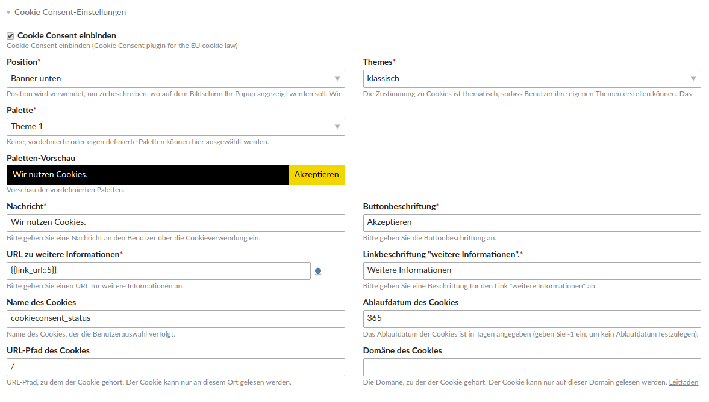
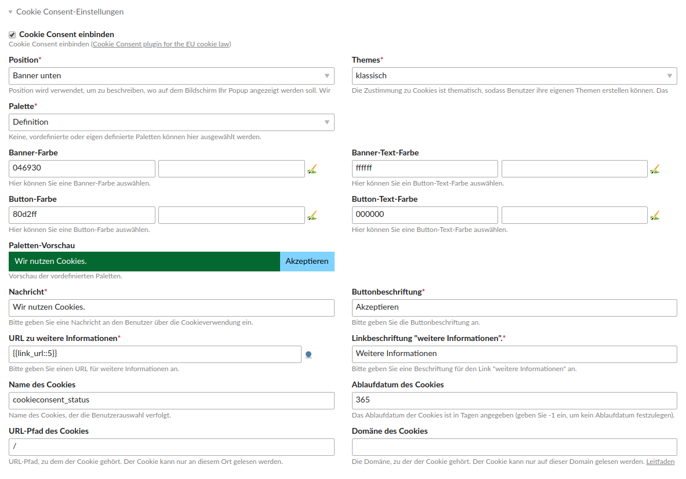

Cookiebar Bundle
================

Das Cookiebar Bundle fügt dem Startpunkt einer Webseite die Option hinzu, einen konfigurierbaren Cookie Consent einzubauen. Die Optik der Cookiebar können Sie durch mehrere auswählbare Optionen selbst gestalten. Auswählbar sind z. B. die Position, das Thema und die Palette, des Weiteren können, unter anderem Nachricht und Beschriftung, sowie eine URL Verlinkung eingetragen werden. Bei der Auswahl der Palette können sie eine vordefinierte, eine eigen definierte oder keine Palette wählen. Bei keiner Ausgewählten Palette müsste die Optik der Cookiebar über CSS-Styles definiert werden.

---

The cookie bar bundle adds the option to include a configurable cookie consent to the starting point of a website. The cookiebar design is selectable by several options. You can select e.g. the position, the topic and the palette, furthermore, among other things message and caption, as well as a URL link can be entered. When selecting the palette, you can choose a predefined, a self-defined or no palette. With no selected palette, the look of the cookie bar would have to be defined using CSS styles.

Screenshots
-----------

Cookiebar mit vordefinierter Palette / Cookie bar with a predefined palette

Frontend

Cookiebar mit selbstdefinierter Palette / Cookie bar with self-defined palette

Frontend

Installation
------------

Install the extension via composer: [trilobit-gmbh/contao-cookiebar-bundle](https://packagist.org/packages/trilobit-gmbh/contao-cookiebar-bundle).

Compatibility
-------------

- Contao version ~4.4 [^1]
- Contao version ~4.9
- Contao version ~4.13

[^1]: Diese Contao-Version wird bei den nächsten Updates nicht mehr berücksichtigt. / This Contao version will no longer be included in the next updates.
